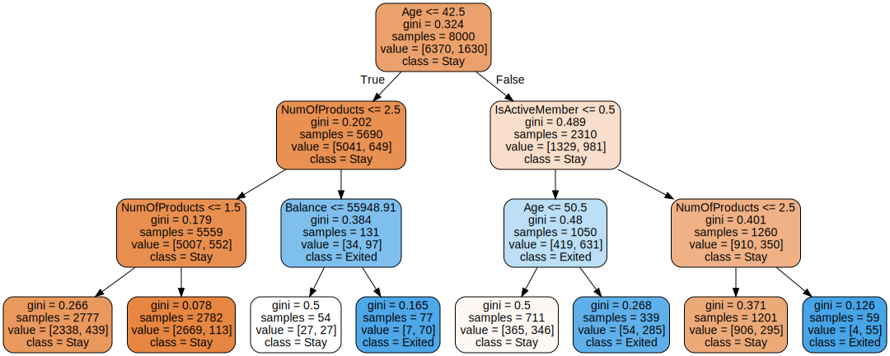

## Decision Tree

- We use a tree with depth 3 to avoid overfitting. The tree is not too complex and easy to interpret. It's better than depth 2. From the graph we can see that, 
   1. if one is younger than 42.5 years old, have no less than 3 products, and with a balance higher than 56K, the probability of churn is high.
   2. if one is older than 50.5 years old, not active then he/she is likely to churn.
   3. if one is older than 42.5 years old, activate and have no less than 3 products, then he/she is likely to churn.
   Thus, in summary, we can see that the product number, balance, age and activeness are important factors that affect the churn rate.


## Ensemble Model
### Gradient Boosting Tree
For the ensemble model, we choose to use gradient boosting tree. We can see that, the important variables are age, number of products, activeness.


|Rank| Importance | Variable|   
|---|---|---|
|1| 0.42 | Age|
|2| 0.36 | NumOfProducts|
|3| 0.14 | IsActiveMember|
|4| 0.04 | Geography|
|5| 0.02 | Balance|


## Comparison
### Predictive Performance
|Model| Accuracy | Precision | Recall | F1 | AUC |
|---|---|---|---|---|---|
|Decision Tree| 0.8420|0.8889|0.2555|0.3969|0.6237|
|Gradient Boosting Tree|0.8535|0.7478|0.4226|0.5400|0.6931

### Interpretation
- We can see that, the ensemble model has better performance than the single tree model on accuracy, recall, F1 and AUC. In the churn prediction, we care more about the recall, which is the proportion of churn customers that are correctly identified. Thus, the ensemble model is better than the single tree model. 
- However, the recall of the ensemble model is still not high enough. We can see that, the recall is only 0.3685. Thus, we need to improve the model to increase the recall.

## Appendix
### Data Preprocessing
We preprocess the data by using ordinal encoder to encode the categorical variables. Since the decision tree forest is not sensitive to the scale of the data, we don't need to scale the data.
```python
data = pd.read_csv('Churn_Modelling.csv')

X = data.drop(['Exited', 'RowNumber', 'CustomerId', 'Surname'], axis=1)
y = data['Exited']

# Splitting the dataset into the Training set and Test set
from sklearn.model_selection import train_test_split
X_train, X_test, y_train, y_test = \
    train_test_split(X, y, test_size = 0.2, random_state = 0, stratify=y)

cat_attribs = ["Geography","Gender","IsActiveMember"]
num_attribs = X.columns.drop(cat_attribs).to_list()

cat_pipeline = make_pipeline(
    OrdinalEncoder()
)
num_pipeline = make_pipeline(
    # StandardScaler(),
    "passthrough"
)

preprocessing = ColumnTransformer([
    ("cat", cat_pipeline, cat_attribs),
    ("num", num_pipeline, num_attribs),
])

X_train = preprocessing.fit_transform(X_train)
```
### Decision Tree
The max depth is 3 to avoid overfitting.
```python
tree_clf = DecisionTreeClassifier(max_depth=3, random_state=42)
tree_clf.fit(X_train, y_train)
```

### Ensemble Model
We choose a learning rate of 0.5, and use early stopping to find the best number of estimators.
```python
from sklearn.ensemble import GradientBoostingRegressor

gbrt_best = GradientBoostingRegressor(
    max_depth=3, learning_rate=0.5, n_estimators=500,
    n_iter_no_change=10, random_state=42)

gbrt_best.fit(X_train, y_train)
```


<!-- ## Requirement -->
<!-- 1. Fit a classification tree with proper model selection. Visualize the final model and describe what you see.

2. Fit an emsemble model (e.g., random forest) with proper model selection. Find out important variables. 

3. Compare the predictive performance and the interpretations of the single tree vs. ensemble model. -->

<!-- - Write an executive summary of your recommendation, a shortlist of evidences, followed with a few sentences of data description and a brief discussions of limitations;
- In the appendix of the executive summary, document technical details that should allow for someone to repeat your analysis, such as data partitioning ratios, model hyperparameters, etc.;
- Attach your code, but your writing should be clear enough to not require having a copy of your code. -->
